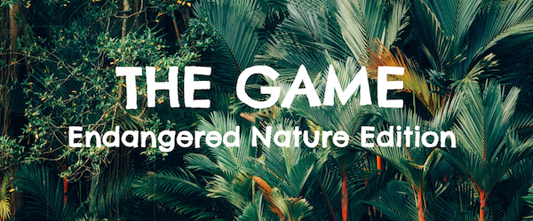
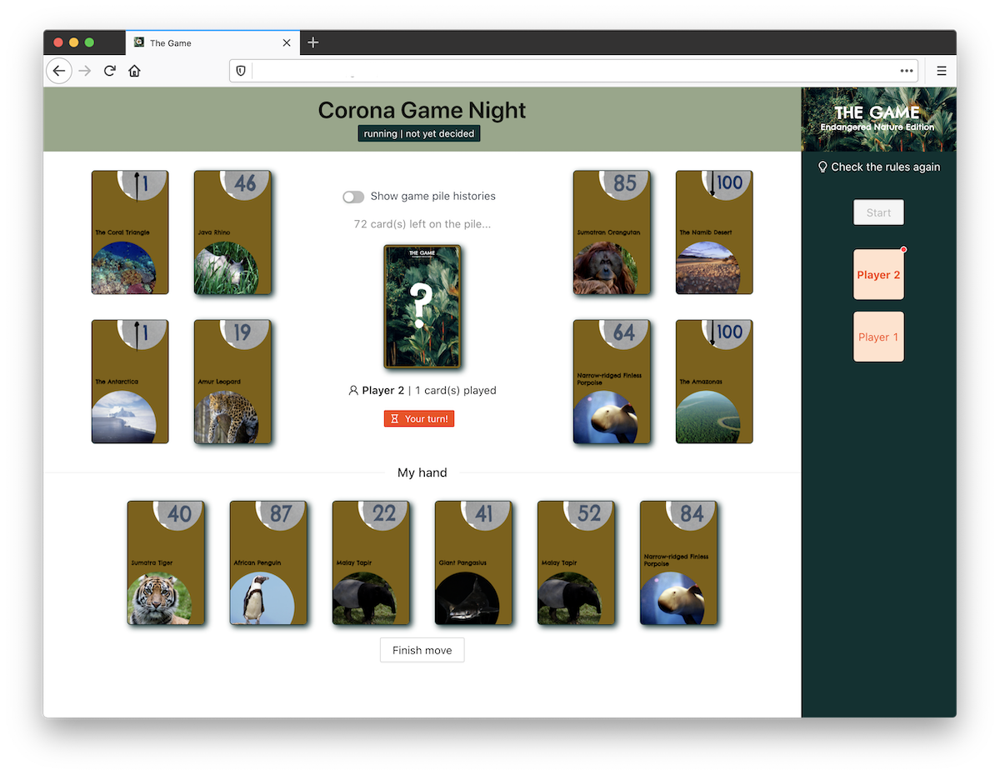
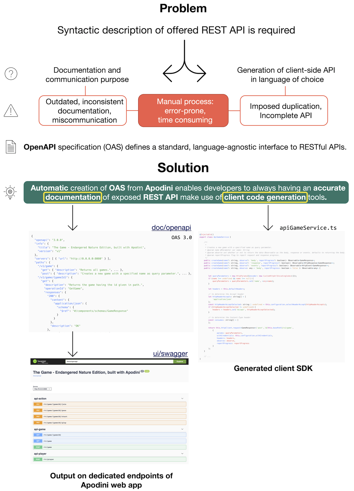

<!-- PROJECT LOGO -->
<br />

<p align="center">
  <a href="https://github.com/lschlesinger/the-game">
    
  </a>
  <p align="center">
    Swift implementation of the card game "The Game", by Steffen Benndorf using the <a href="https://github.com/Apodini/Apodini">Apodini Framework</a>.
    The Endangered Natur Edition is based on an environmental education concept, which aims to raise awareness of the current threats to certain species.
      </p>
    <br/>
  </p> 
</p>

<!-- TABLE OF CONTENTS -->

## Table of Contents

* [About the Project](#about-the-project)
  * [Environmental Mission](#environmental-mission)
  * [Technical Mission](#technical-mission)
  * [Built With](#built-with)
* [Getting Started](#getting-started)
* [Critical Reflection of the Software](#critical-reflection)
* [License](#license)

<!-- ABOUT THE PROJECT -->

## About the Project

Find more information about the original game [here](http://middys.nsv.de/middys/the-game/).
This is how our edition looks like:
<p align="center">
  
</p>

We hope you have fun playing it!

Please find acknowledgement as well as the source of the pictures used [here](Documentation/Acknowledgement.md).

### Environmental Mission

...

### Technical Mission

By using the [Apodini Framework](https://github.com/Apodini/Apodini), this sample project tackles the following problem:
<p align="center">
  
</p>

### Built With

* [Apodini](https://github.com/Apodini/Apodini)
* [Swagger Codegen](https://github.com/swagger-api/swagger-codegen) using [OpenAPI Specification 3.0.3](https://swagger.io/specification/)
* [Angular](https://angular.io/)
* [Ant Design](https://ant.design/docs/react/introduce)
* [Docker](https://www.docker.com/)
* [NGINX](https://www.nginx.com/)

<!-- GETTING STARTED -->

## Getting Started

### Docker Setup

#### Requirements

* Docker
* Docker Compose

#### Run

To get a local copy up and running follow these simple steps.

1. Clone the repo

```sh
git clone git@github.com:lschlesinger/the-game.git
```
2. Start backend and nginx which serves frontend

```sh
docker-compose up
```

3. Visit `http://localhost:80`

### Development Setup

#### Requirements

* Node.js
* npm
* Swift

#### Run


To get a local copy up and running follow these simple steps.

1. Clone the repo

```sh
git clone git@github.com:lschlesinger/the-game.git
```
2. Start backend

```sh
swift run
```
3. Start frontend

```sh
cd game-web-ui
npm run start
```

4. Visit `http://localhost:4200` for frontend (all request to backend will be proxied)
	1. Visit `http://localhost:8080/doc/openapi` (if not configured differently) to see the generated OpenAPI specification
	2. Visit `http://localhost:8080/ui/swagger` (if not configured differently) to see explore the web app with swagger-ui


<!-- CRITICAL REFLECTION -->

## Critical Reflection of the Software


<!-- LICENSE -->

## License

Distributed under the GPL-3.0 License. See `LICENSE` for more information.

## Contributors

:two_women_holding_hands: L&L Schlesinger
